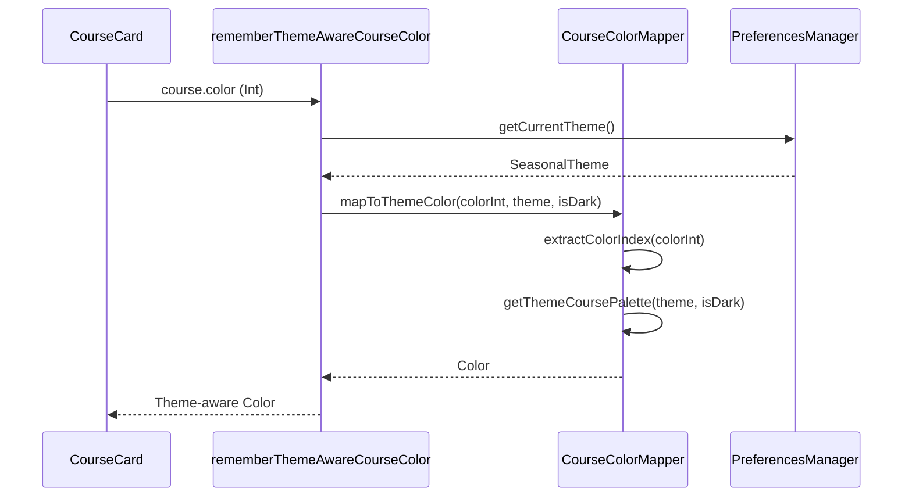
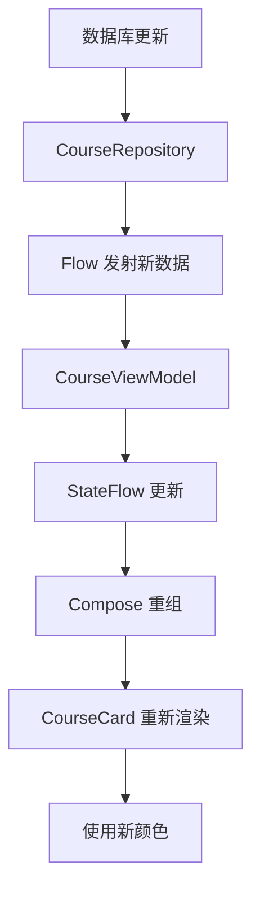

# 设计文档

## 概述

本设计旨在解决课程卡片的两个核心问题：(1) 颜色不响应主题变化，(2) 数据更新后不自动同步。解决方案包括创建主题感知的颜色映射系统和优化数据流响应机制。

## 架构

### 当前问题分析

1. **颜色硬编码问题**
   - `CourseCard` 组件直接使用 `Color(course.color)` 将整数值转换为颜色
   - 这个整数值在创建课程时由 `CourseColorAssigner` 基于当时的主题生成
   - 当用户切换主题后，存储的整数值不会改变，导致颜色不匹配新主题

2. **数据同步问题**
   - `CourseViewModel` 已经使用 `StateFlow` 和响应式数据流
   - 问题可能出在 Compose 的重组触发机制
   - 需要确保数据变化能够正确触发 UI 重组

### 解决方案架构

```
┌─────────────────────────────────────────────────────────────┐
│                        UI Layer                              │
│  ┌──────────────┐         ┌─────────────────────────────┐  │
│  │ CourseCard   │────────>│ ThemeAwareCourseColor       │  │
│  │ Component    │         │ Composable Function         │  │
│  └──────────────┘         └─────────────────────────────┘  │
│         │                            │                       │
│         │                            ▼                       │
│         │                  ┌──────────────────┐             │
│         │                  │ CourseColorMapper│             │
│         │                  └──────────────────┘             │
│         │                            │                       │
└─────────┼────────────────────────────┼───────────────────────┘
          │                            │
          ▼                            ▼
┌─────────────────────────────────────────────────────────────┐
│                      Domain Layer                            │
│  ┌──────────────┐         ┌─────────────────────────────┐  │
│  │ Course Model │         │ ColorPalette                │  │
│  │ (unchanged)  │         │ (per theme)                 │  │
│  └──────────────┘         └─────────────────────────────┘  │
└─────────────────────────────────────────────────────────────┘
          │
          ▼
┌─────────────────────────────────────────────────────────────┐
│                      Data Layer                              │
│  ┌──────────────────────────────────────────────────────┐  │
│  │ CourseRepository (Flow-based, reactive)              │  │
│  └──────────────────────────────────────────────────────┘  │
└─────────────────────────────────────────────────────────────┘
```

## 组件和接口

### 1. CourseColorMapper

**职责**: 将课程的颜色索引映射到当前主题的对应颜色

**接口**:
```kotlin
object CourseColorMapper {
    /**
     * 将课程颜色整数值映射到当前主题的颜色
     * @param colorInt 存储的颜色整数值
     * @param theme 当前主题
     * @param isDark 是否为深色模式
     * @return 主题感知的 Color 对象
     */
    fun mapToThemeColor(
        colorInt: Int,
        theme: SeasonalTheme,
        isDark: Boolean
    ): Color
    
    /**
     * 获取当前主题的课程调色板
     * @param theme 当前主题
     * @param isDark 是否为深色模式
     * @return 12种协调的课程颜色列表
     */
    fun getThemeCoursePalette(
        theme: SeasonalTheme,
        isDark: Boolean
    ): List<Color>
    
    /**
     * 从颜色整数值提取颜色索引
     * @param colorInt 存储的颜色整数值
     * @return 颜色索引 (0-11)
     */
    fun extractColorIndex(colorInt: Int): Int
}
```

**实现策略**:
- 为每个主题定义一组12种协调的课程颜色
- 使用颜色整数值的某个部分（如最后4位）作为索引
- 当主题切换时，保持索引不变，但返回新主题的对应颜色
- 确保颜色在浅色和深色模式下都有良好的对比度

### 2. ThemeAwareCourseColor Composable

**职责**: 提供一个 Composable 函数，自动响应主题变化

**接口**:
```kotlin
@Composable
fun rememberThemeAwareCourseColor(colorInt: Int): Color
```

**实现**:
```kotlin
@Composable
fun rememberThemeAwareCourseColor(colorInt: Int): Color {
    val theme = // 从 PreferencesManager 获取当前主题
    val isDark = isSystemInDarkTheme()
    
    return remember(colorInt, theme, isDark) {
        CourseColorMapper.mapToThemeColor(colorInt, theme, isDark)
    }
}
```

### 3. 更新 CourseCard 组件

**修改点**:
- 将 `Color(course.color)` 替换为 `rememberThemeAwareCourseColor(course.color)`
- 确保所有使用课程颜色的地方都使用新的函数

**示例**:
```kotlin
@Composable
fun CourseCard(
    course: Course,
    onClick: () -> Unit,
    modifier: Modifier = Modifier,
    currentWeek: Int? = null
) {
    val courseColor = rememberThemeAwareCourseColor(course.color)
    
    Card(
        modifier = modifier
            .fillMaxWidth()
            .clickable(onClick = onClick),
        colors = CardDefaults.cardColors(
            containerColor = courseColor.copy(alpha = 0.15f)
        ),
        // ...
    ) {
        // 使用 courseColor 替代 Color(course.color)
    }
}
```

### 4. 更新 CourseColorAssigner

**修改点**:
- 在分配颜色时，不仅存储颜色值，还存储颜色索引
- 使用特殊的编码方式将索引嵌入到整数值中

**编码方案**:
```
颜色整数值 = (索引 << 28) | (原始颜色值 & 0x0FFFFFFF)
最高4位存储索引 (0-11)
其余28位存储原始颜色值（用于向后兼容）
```

**实现**:
```kotlin
object CourseColorAssigner {
    fun assignColor(
        existingCourses: List<Course>,
        dayOfWeek: DayOfWeek,
        startTime: LocalTime,
        endTime: LocalTime,
        primaryColor: Color
    ): Int {
        val colorPalette = generateColorPalette(primaryColor)
        val colorIndex = selectColorIndex(existingCourses, dayOfWeek, startTime, endTime)
        val selectedColor = colorPalette[colorIndex]
        
        // 编码：将索引存储在最高4位
        return (colorIndex shl 28) or (selectedColor and 0x0FFFFFFF)
    }
    
    private fun selectColorIndex(
        existingCourses: List<Course>,
        dayOfWeek: DayOfWeek,
        startTime: LocalTime,
        endTime: LocalTime
    ): Int {
        // 现有的颜色选择逻辑，但返回索引而不是颜色值
        // ...
    }
}
```

## 数据模型

### Course 模型

**不需要修改** - 保持向后兼容性

```kotlin
data class Course(
    val id: Long = 0,
    val name: String,
    // ...
    val color: Int,  // 编码后的颜色值（包含索引）
    // ...
)
```

### 主题调色板定义

为每个主题定义课程颜色调色板：

```kotlin
object ThemeCoursePalettes {
    // 樱花主题调色板
    val sakuraLight = listOf(
        Color(0xFFE91E63), // 粉红
        Color(0xFFFF4081), // 深粉
        Color(0xFFF06292), // 浅粉
        Color(0xFFAD1457), // 玫瑰
        // ... 共12种颜色
    )
    
    val sakuraDark = listOf(
        Color(0xFFF48FB1), // 浅粉（深色模式）
        Color(0xFFFF80AB), // 亮粉
        // ... 共12种颜色
    )
    
    // 为每个主题定义类似的调色板
    // ...
}
```

## 错误处理

### 1. 无效颜色索引

**场景**: 旧数据可能没有编码索引

**处理**:
```kotlin
fun extractColorIndex(colorInt: Int): Int {
    val index = (colorInt ushr 28) and 0xF
    return if (index in 0..11) index else 0  // 默认使用索引0
}
```

### 2. 主题不存在

**场景**: 未知的主题类型

**处理**:
```kotlin
fun getThemeCoursePalette(theme: SeasonalTheme, isDark: Boolean): List<Color> {
    return when (theme) {
        SeasonalTheme.SAKURA -> if (isDark) sakuraDark else sakuraLight
        // ...
        else -> if (isDark) sakuraDark else sakuraLight  // 默认使用樱花主题
    }
}
```

### 3. 数据同步失败

**场景**: 数据库更新但 UI 未刷新

**处理**:
- 确保 `CourseRepository` 返回的 Flow 正确发射更新
- 在 `CourseViewModel` 中添加日志以跟踪数据流
- 使用 `distinctUntilChanged()` 避免重复发射

## 测试策略

### 单元测试

1. **CourseColorMapper 测试**
   - 测试颜色索引提取
   - 测试主题颜色映射
   - 测试所有主题的调色板生成
   - 测试向后兼容性（旧颜色值）

2. **CourseColorAssigner 测试**
   - 测试颜色索引编码
   - 测试颜色选择逻辑
   - 测试相邻课程颜色不重复

### UI 测试

1. **CourseCard 测试**
   - 测试主题切换时颜色更新
   - 测试深色/浅色模式切换
   - 测试颜色对比度

2. **集成测试**
   - 测试导入课程后颜色正确显示
   - 测试修改课程后颜色保持一致
   - 测试主题切换后所有课程卡片更新

### 性能测试

1. **颜色映射性能**
   - 测试大量课程时的渲染性能
   - 确保颜色计算不阻塞 UI 线程

2. **数据同步性能**
   - 测试大量课程更新时的响应时间
   - 确保 Flow 不会导致内存泄漏

## 实现注意事项

### 1. 向后兼容性

- 旧版本创建的课程可能没有编码索引
- 需要优雅地处理这些情况，使用默认索引
- 不修改数据库结构，避免迁移问题

### 2. 性能优化

- 使用 `remember` 缓存颜色计算结果
- 避免在每次重组时重新计算颜色
- 使用 `derivedStateOf` 优化依赖计算

### 3. 可访问性

- 确保所有颜色组合满足 WCAG 对比度要求
- 在深色模式下使用更亮的颜色
- 提供足够的视觉区分度

### 4. 主题一致性

- 课程颜色应与主题的整体色调协调
- 避免使用与主题冲突的颜色
- 保持视觉层次清晰

## 迁移计划

### 阶段1: 创建颜色映射系统
- 实现 `CourseColorMapper`
- 定义所有主题的调色板
- 编写单元测试

### 阶段2: 更新 UI 组件
- 创建 `rememberThemeAwareCourseColor`
- 更新 `CourseCard` 组件
- 更新其他使用课程颜色的组件

### 阶段3: 更新颜色分配逻辑
- 修改 `CourseColorAssigner` 以编码索引
- 确保新创建的课程使用新格式
- 测试向后兼容性

### 阶段4: 验证和优化
- 进行全面测试
- 优化性能
- 修复发现的问题

## Mermaid 图表

### 颜色映射流程



### 数据同步流程



## 设计决策

### 为什么使用颜色索引而不是直接存储主题相关颜色？

**优点**:
- 主题切换时无需修改数据库
- 保持数据模型简单
- 易于添加新主题
- 向后兼容

**缺点**:
- 需要额外的映射逻辑
- 颜色选择受限于预定义调色板

**决策**: 使用颜色索引，因为灵活性和可维护性更重要

### 为什么在整数值中编码索引而不是添加新字段？

**优点**:
- 不需要修改数据库结构
- 不需要数据迁移
- 完全向后兼容
- 对现有代码影响最小

**缺点**:
- 编码/解码逻辑稍微复杂
- 颜色值精度略微降低（28位而不是32位）

**决策**: 使用编码方式，因为避免数据库迁移的价值更高

### 为什么使用 Composable 函数而不是 ViewModel 中的转换？

**优点**:
- 自动响应主题变化
- 利用 Compose 的重组机制
- 代码更简洁
- 更符合 Compose 的设计理念

**缺点**:
- 颜色计算在 UI 层进行
- 可能需要更多的重组

**决策**: 使用 Composable 函数，因为它更符合响应式 UI 的设计模式
