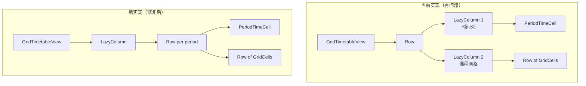
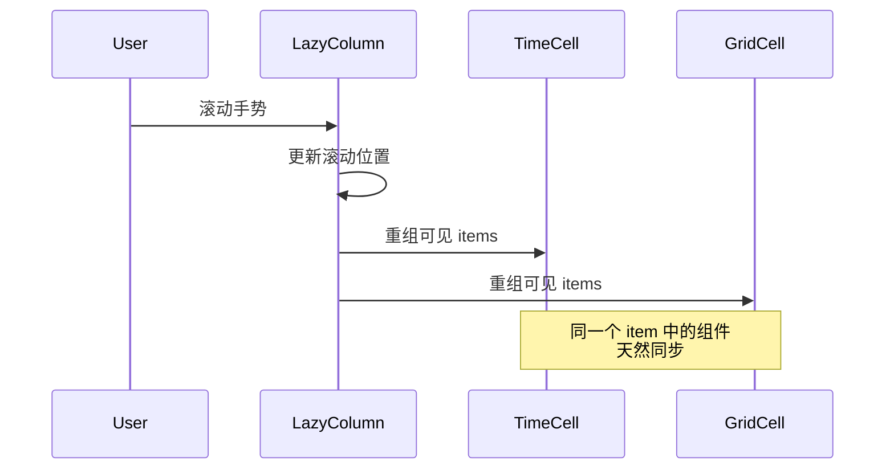

# 设计文档

## 概述

修复课程表网格视图中左侧时间列和右侧课程网格的滚动同步问题。当前实现使用了两个独立的 `LazyColumn` 组件，虽然共享同一个 `LazyListState`，但在实际运行中无法保证完美同步。本设计将重构为使用单个 `LazyColumn`，每行包含时间单元格和课程单元格，从而确保滚动同步。

## 架构

### 当前实现问题分析

```kotlin
Row {
    // 左侧时间列 - 独立的 LazyColumn
    LazyColumn(state = listState, userScrollEnabled = false) {
        items(periods) { period -> PeriodTimeCell(...) }
    }
    
    // 右侧课程网格 - 独立的 LazyColumn
    LazyColumn(state = listState) {
        items(periods) { period -> Row { /* 课程单元格 */ } }
    }
}
```

**问题**: 两个独立的 `LazyColumn` 即使共享 `LazyListState`，在 Compose 的布局和绘制阶段也可能出现不同步的情况，特别是在快速滚动或设备性能较低时。

### 新架构设计

```kotlin
Row {
    // 固定宽度的时间列占位符
    Spacer(width = 60.dp)
    
    // 单个 LazyColumn 包含所有行
    LazyColumn(state = listState) {
        items(periods) { period ->
            Row {
                // 时间单元格（固定宽度）
                PeriodTimeCell(period, width = 60.dp)
                
                // 课程单元格行
                Row(modifier = Modifier.weight(1f)) {
                    weekDays.forEach { day ->
                        GridCell(day, period, ...)
                    }
                }
            }
        }
    }
}
```

**优势**:
1. 单个滚动容器，天然保证同步
2. 更简单的状态管理
3. 更好的性能（减少一个 LazyColumn 的开销）
4. 更符合 Compose 的最佳实践

## 组件和接口

### 修改的组件

#### 1. GridTimetableView

**修改内容**:
- 移除双 `LazyColumn` 结构
- 改用单个 `LazyColumn`，每个 item 包含完整的一行（时间 + 课程）
- 保持相同的公共 API，不影响调用方

**新布局结构**:
```
Column {
    // 顶部固定行
    Row {
        Spacer(60.dp)  // 左上角占位
        DayHeaderRow   // 星期标题
    }
    
    // 可滚动内容
    LazyColumn {
        items(periods) { period ->
            Row {
                PeriodTimeCell(period, 60.dp)  // 时间单元格
                Row(weight=1f) {                // 课程单元格行
                    weekDays.forEach { day ->
                        GridCell(...)
                    }
                }
            }
        }
    }
}
```

#### 2. PeriodTimeCell

**修改内容**:
- 确保组件可以在 `LazyColumn` 的 item 中正常工作
- 保持固定宽度 60.dp
- 保持当前的视觉样式和动画效果

**无需修改**: 该组件已经设计为独立的单元格，可以直接在新结构中使用。

#### 3. GridCell

**修改内容**:
- 确保组件在新的行布局中正常工作
- 保持响应式宽度（使用 `weight(1f)`）

**无需修改**: 该组件已经是独立的单元格，可以直接使用。

## 数据模型

无需修改数据模型，所有现有的数据结构保持不变：
- `Course`
- `CoursePeriod`
- `GridLayoutConfig`
- `DayOfWeek`

## 错误处理

### 滚动性能监控

虽然新方案应该能解决同步问题，但仍需考虑性能：

1. **大量课程时的性能**: 使用 `LazyColumn` 的懒加载特性，只渲染可见区域
2. **快速滚动**: Compose 的 `LazyColumn` 已经优化了快速滚动场景
3. **内存管理**: 减少一个 `LazyColumn` 实际上降低了内存占用

### 边界情况

1. **空课程表**: 仍然显示时间列和空网格
2. **单节课**: 正常显示
3. **课程冲突**: 保持现有的冲突处理逻辑

## 测试策略

### 单元测试

不需要新的单元测试，因为：
1. 组件逻辑没有改变
2. 只是布局结构的重组
3. 现有的组件测试仍然有效

### UI 测试

**手动测试场景**:

1. **基本滚动同步**
   - 操作: 在课程网格区域上下滚动
   - 预期: 左侧时间列完美同步，无延迟或错位

2. **快速滚动**
   - 操作: 快速滑动课程表
   - 预期: 时间列和课程网格保持同步，无撕裂或跳跃

3. **自动滚动到当前时间**
   - 操作: 打开课程表页面
   - 预期: 自动滚动到当前节次，时间列和课程网格对齐

4. **不同屏幕尺寸**
   - 操作: 在不同尺寸的设备上测试
   - 预期: 所有设备上滚动都同步

5. **性能测试**
   - 操作: 在有大量课程的课程表上滚动
   - 预期: 流畅无卡顿，帧率稳定

### 回归测试

确保以下现有功能不受影响：
- 课程点击
- 空单元格点击
- 当前节次高亮
- 周次切换
- 课程颜色显示
- 课程冲突显示

## 实现注意事项

### 性能优化

1. **避免不必要的重组**
   - 使用 `remember` 缓存计算结果
   - 使用 `derivedStateOf` 处理派生状态
   - 为 lambda 使用稳定的引用

2. **布局优化**
   - 使用固定的 `cellHeight` 避免测量开销
   - 使用 `Arrangement.spacedBy` 统一间距
   - 避免嵌套过深的布局

### 代码质量

1. **保持向后兼容**: 不改变 `GridTimetableView` 的公共 API
2. **代码复用**: 继续使用现有的 `PeriodTimeCell` 和 `GridCell` 组件
3. **可读性**: 新结构更简单，更容易理解和维护

### 迁移风险

**风险**: 低
- 只修改一个文件 (`GridTimetableView.kt`)
- 不影响其他组件
- 不改变数据流
- 可以快速回滚

## 设计决策和理由

### 为什么选择单 LazyColumn 方案？

1. **天然同步**: 单个滚动容器不存在同步问题
2. **性能更好**: 减少一个 LazyColumn 的开销
3. **代码更简单**: 更少的状态管理，更清晰的结构
4. **Compose 最佳实践**: 官方推荐的实现方式

### 为什么不使用其他方案？

**方案 A: 使用 ScrollableRow + Column**
- 缺点: 不支持懒加载，大量课程时性能差

**方案 B: 使用自定义滚动同步逻辑**
- 缺点: 复杂度高，容易出 bug，维护成本高

**方案 C: 使用 LazyVerticalGrid**
- 缺点: 不适合这种左侧固定列的场景

### 为什么保持 60.dp 的时间列宽度？

1. 足够显示"第X节"和时间范围
2. 不占用过多横向空间
3. 与现有设计保持一致
4. 在各种屏幕尺寸上都合适

## Mermaid 图表

### 组件结构对比



### 滚动同步流程


